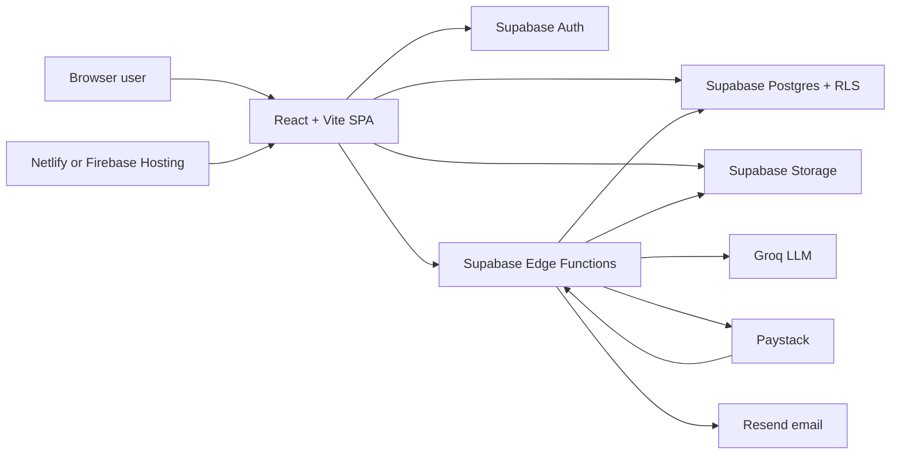

# Bizzlivo — Complete Current System Overview

> **Purpose:** Give this entire file to ChatGPT or another developer before asking it to work on Bizzlivo. It describes the system as it exists in the current working tree, including its architecture, user roles, workflows, data model, security rules, integrations, deployment model, and known gaps.
>
> **Snapshot date:** 6 September 2026. The application is evolving. When this document and the source disagree, the source code and newest numbered database migration are authoritative.

## 1. Product summary

Bizzlivo is a multi-tenant office management, learning, assessment, and member-development platform. Each office is an isolated organization with its own branding, people, teams, learning material, exams, assignments, events, performance data, and subscription.

The original product was a computer-based testing (CBT) platform: an administrator uploads a PDF, AI creates questions, staff review them, an exam is published and assigned, and members take it online. The current product has expanded into an operating system for a network-marketing/training organization. It now covers:

- Office registration and branded office login pages.
- Member invitations, public join requests, approval, roles, teams, and team leaders.
- A five-stage Learning Center: Onboarding, Personal Development, Skill Development, Income Development, and Network Marketing.
- PDF/video/podcast resources, structured classes, coursework assignments, and exams.
- A per-office **Business Path**: an admin-built ladder of ranks, each with its own Learning Path and Business Tasks that point at existing content and activity. Replaces the older single "daily task flow".
- Member goals, daily reports, rank progression, income tracking, and weekly leaderboards.
- Events and attendance.
- Admin dashboards, analytics, exam rosters, attempt details, and team performance.
- Free/Growth/Business subscription plans with Paystack checkout.

Bizzlivo is a client-rendered React application backed by Supabase. Most data access goes directly from the browser to Supabase and is secured with Postgres Row Level Security (RLS). Privileged or anonymous workflows use Supabase Edge Functions.

## 2. Architecture at a glance



The frontend contains no conventional application server. Supabase provides authentication, the database, object storage, RPC functions, and serverless Edge Functions. Tenant isolation is based on `org_id` plus RLS rather than separate databases.

## 3. Technology stack

| Layer | Current implementation |
|---|---|
| Frontend | React 19, TypeScript, React Router 7 |
| Build tooling | Vite 8, TypeScript project references |
| Styling | One global CSS design system in `src/index.css`; dark/light themes |
| Backend | Supabase Postgres, Auth, Storage, RPC, Edge Functions |
| Browser data SDK | `@supabase/supabase-js` |
| Edge runtime | Supabase/Deno TypeScript functions |
| AI question generation | Groq OpenAI-compatible chat completions, currently `llama-3.3-70b-versatile` |
| Payments | Paystack inline checkout, webhook, and transaction verification |
| Transactional email | Resend, used when approving a pending member |
| Existing production hosting | Firebase Hosting at `https://hq360-cbt.web.app` according to the repository README |
| New hosting configuration | `netlify.toml` builds with `npm run build`, publishes `dist`, and rewrites all routes to `index.html` |

Required frontend environment variables:

```text
VITE_SUPABASE_URL
VITE_SUPABASE_ANON_KEY
VITE_PAYSTACK_PUBLIC_KEY
```

Server-only secrets belong in Supabase Edge Function secrets and must never be added to the frontend or committed:

```text
GROQ_API_KEY
PAYSTACK_SECRET_KEY
RESEND_API_KEY
```

Supabase automatically injects its URL, anonymous key, and service-role key into deployed Edge Functions.

## 4. Multi-tenancy and identity

### 4.1 Identity objects

Authentication starts in Supabase Auth (`auth.users`). Each authenticated user also has:

- A `profiles` row for name, email, phone, avatar, member status, and sponsor information.
- One or more `memberships` rows connecting that profile to offices.
- A role and membership status for each office.

The application loads the session, profile, and all active memberships in `AuthContext`. The selected office is stored in browser local storage under `hq360.currentOrgId`. If the saved office is unavailable, the first active membership becomes current.

### 4.2 Organization creation

The `/signup` page collects full name, office name, email, and password. It sends the name and office name as Supabase Auth user metadata.

After the user is authenticated, `completeOfficeSignup()` creates, or safely resumes creating:

1. The user's `profiles` row.
2. An `organizations` row with a unique slug.
3. An active admin membership for the creator.
4. A 14-day Growth trial through `start_trial()` when possible.

The process is idempotent because email confirmation may split signup across multiple browser sessions, and React/Supabase auth events can fire more than once. A module-level in-flight guard prevents duplicate organizations during concurrent auth refreshes.

### 4.3 Office-specific login

An office can be reached through `/o/:slug/login`. The application also recognizes wildcard hosts such as `blaze-office.hq360.space`, extracts `blaze-office`, and shows that office's branded login/join screen.

The wildcard-domain code assumes DNS and proxy infrastructure route `*.hq360.space` to the frontend. The browser app only interprets the hostname; it does not configure DNS.

If a signed-in user opens an office subdomain, the app selects that office when the user has an active membership. Otherwise it explains that the account is not a member there.

### 4.4 Joining an office

There are three entry paths:

1. **Invite link:** an admin creates an invite and shares `/invite/:token`. A new user signs up or an existing user logs in. The Edge Functions preview and accept the invite, create the membership, and can attach earlier guest exam attempts with the same email.
2. **Office join request:** a visitor on the branded office login page can request access. This creates a `pending_members` row and notifies office staff.
3. **Public exam registration:** a visitor with `/take/:token` enters an email. The app checks whether the account exists, then offers login or signup. Starting the exam registers the authenticated user as an office member if needed.

Approving a pending member creates an invite and attempts to send its link through Resend. Failure to send email does not roll back the database changes, so the link can still be copied manually.

## 5. Role model and permissions

The active role names are:

| Role | Main responsibility |
|---|---|
| `admin` | Full office management, settings, billing, people, teams, content, exams, and reports |
| `trainer` | Creates and manages learning content, exams, assignments, and events; UI may narrow trainers to classes assigned to them. **Read-only** on Business Path configuration. |
| `team_leader` | Manages or views their team and team-scoped performance; has less office-wide authority than admin/trainer. **Read-only** on Business Path configuration; can promote members of groups they lead via the `promote_member` RPC. |
| `member` | Completes training, exams, and their Business Path requirements; manages personal goals, reports, contacts, portfolio, and income |

Migration `0027_role_model_v2.sql` normalized older `owner` and `instructor` concepts into the current four-role model. Some older comments and policy names still say “owner” or “instructor”; always check the latest policy definition before relying on those labels.

Role-dependent pages are mostly selected inside page components and hidden from navigation. `ProtectedRoute` verifies authentication but does not centrally enforce a role per URL. Postgres RLS is therefore the real security boundary if somebody manually opens a staff route.

## 6. Main application routes

Public routes:

| Route | Purpose |
|---|---|
| `/` (main domain, logged out) | **Marketing landing page** (`src/pages/marketing/Landing.tsx`) — hero, feature grid, how-it-works, pricing teaser, FAQ, CTA. Theme-aware, self-contained (`.lp-*` CSS, inline SVG, no external assets). `App.tsx > RootGate` renders it when there is no session and no office subdomain; a signed-in user gets their dashboard, an office subdomain still gets `OfficeAwareRoot`. |
| `/signup` | Create an office and its first admin account |
| `/login` | Generic account login |
| `/o/:slug/login` | Office-branded login and join request |
| `/invite/:token` | Preview and accept an invitation |
| `/take/:token` | Register/login and take a public-link exam |

Authenticated routes:

| Area | Routes |
|---|---|
| Home | `/` |
| Initial setup | `/onboarding` |
| Exams | `/exams`, `/exams/:examId`, `/generate`, `/review`, `/settings`, `/analytics`, `/roster` and attempt detail |
| Coursework | `/assignments`, `/assignments/new`, `/assignments/:id`, `/my-assignments`, `/my-assignments/:id` |
| Learning Center | `/training`, `/training/classes/:classId` |
| Business Path | `/business-path`, `/business-path/ranks/:rankId` (admin path builder). Legacy `/tasks` and `/rank` now redirect here. |
| Member development | `/goals`, `/wallet` |
| People and teams | `/invites`, `/invites/assign`, `/team-performance`, `/team-performance/:teamId`, `/my-team` |
| CBT member area | `/cbt`, `/cbt/:assignmentId/take`, `/cbt/attempts/:attemptId/result` |
| Events | `/events`, `/events/new`, `/events/:eventId`, `/events/:eventId/edit` |
| Reporting | `/reports`, `/reports/training`, `/leaderboard` |
| Office management | `/settings`, `/billing` |

Unknown routes redirect to `/`.

## 7. Dashboards and navigation

The dashboard changes by role.

### 7.1 Admin/trainer dashboard

The office-wide dashboard loads membership, invite, exam, publication, resource, question-review, attempt, notification, and assignment statistics. It includes:

- A time-aware greeting and the office's branded login URL.
- Office/member/exam/resource KPIs.
- Setup progress.
- Recent exams and recent activity.
- Seven-day exam activity.
- Team and assignment metrics.
- An AI-generated office summary through `dashboard-ai-summary`.

### 7.2 Member dashboard — rank-aware progress command center (`0040`)

`src/pages/dashboard/MemberHome.tsx` renders whatever the member's **current Business Path rank** requires — it has no per-rank layout. It reads `loadPathState()` once and shows: a compact header (Current Rank / Overall % / Next Rank), the rank ladder (`✓` done / `●` current / `🔒` locked), a Current Rank Summary (requiredDone/Total, Learning n/m, Tasks a/b, Continue Business Path), a **Current Focus** card (first unfinished required requirement), the **Current Rank Requirements** list (`All / Learning / Tasks` filter — each row shows auto/manual, progress, status, and a deep link), Learning Progress for the areas that rank references, a compact Needs Attention (top ~4), Goals (stage-aware: set-first / 90-day / monthly), a small My Network snapshot, Upcoming (only items with a real due/start date), and Recent Activity. When every required requirement is done it shows the promotion banner (auto-advances, or "awaiting staff approval"). The old scattered cards (Today's report, Streak, Follow-ups, repeated Business Path cards, weekly leaderboard) were removed.

Migrations `0034`–`0040` are all applied to the linked production database.

**Today's Focus / Action Center.** A full-width `src/pages/dashboard/TodayActionCenter.tsx` panel sits above the dashboard grid and answers "what should I do today?". `src/lib/actionCenter.ts` `loadActions(orgId, userId, path)` builds one prioritized `Action[]` — `{ id, category (goals|business_path|network|freelance|finance), priority (critical|high|normal), title, description?, ctaLabel, ctaRoute }` — derived live from source systems, nothing stored: missing monthly goals / goal changes-requested / goals ready to submit; Business Path items in `changes_requested`/`rejected`, approval-mode promotion ready, next required item; overdue network prospect follow-ups; freelance overdue projects + follow-ups due; available wallet balance. Sorted critical → high → normal; shows 5 with "+N more". No table — client-only.

### 7.3 Navigation

Members see grouped navigation: Dashboard, Onboarding/Training, **Business Path**, Goals, Reports, Network, Leaderboard, Wallet. (The old separate "Tasks" and "Rank Journey" items are folded into Business Path.)

Staff see Dashboard, **Business Path**, Learning Center, Members, Team Performance, Leaderboard, Events, Reports, and Settings according to role. Communication, search, and the AI assistant still display as coming-soon or disabled controls.

## 8. Learning Center (v2 — `0038_learning_center.sql`)

The Learning Center is the single home for every piece of learning content. `/training` renders `src/pages/learning/LearningCenter.tsx`, which role-routes to an admin LMS or a member view. It has five areas, each managed independently:

**Onboarding · Network Marketing · Freelancing · Personal Development · Income Development**

Business Path (§9) is separate: Learning Center is *what to learn*, Business Path is *what to accomplish to progress*.

**Rank-gated areas (member view).** `businessPath.loadLearningAreaAccess(orgId, userId)` returns which areas the member's *current rank position* unlocks — position 0 (Prospect) → Onboarding only; position 1 (Newbie) → all except Income Development; position 2+ → all. Gating is by `business_path_ranks.order_index` (not slug), so renamed/reordered ranks still work. `MemberLearningCenter` renders locked areas as a dashed `.lc-area-card.locked` tile ("Unlocks at <rank>") and blocks direct `?area=` navigation to a locked area; the "Continue learning" banner skips locked areas. Staff views are ungated.

### 8.1 Shared model

Four areas (Network Marketing's NeoLife Basics, Freelancing, Personal Development's Mind Training, Income Development) run on the generalised `classes` family:

```
Area (classes.area)  →  Section (a classes row, ordered by section_order)
                     →  Module/Lesson (class_modules; has description + draft/published status)
                     →  Content Item (class_module_items)
```

A content item is a pointer at existing content — never a copy: `video`/`pdf`/`podcast` → a `resources` row; `link` → `link_url`; `article` → inline `body`; `quiz` → an `exams` row (surfaced as "Quiz"); `assignment` → a `coursework_assignments` row. `0038` added `classes.area` + `section_order`, `class_modules.description`/`status`, and the `link`/`podcast` item types + `class_module_items.link_url`. Member reads now also require `class_modules.status = 'published'`.

Completion: `video`/`pdf`/`podcast`/`link`/`article` → a `class_item_progress` row; `quiz` → a passing `attempts` row; `assignment` → an approved `coursework_submissions` row. A module is complete when all its items are.

`classes.purpose` (`skill_development`/`income_development`) is kept for rollback; `0038` set `area` from it (`skill_development → freelancing`, `income_development → income_development`). Trainers and team leaders manage `classes`-backed content (existing `0022`/`0031` RLS).

### 8.2 Onboarding

Keeps its own tables — `onboarding_modules` (the grouping layer added by `0038`), `onboarding_step_items` (types `pdf`/`video`/`link`/`quiz`; own `onboarding` storage bucket), `onboarding_progress` (only `registered_at` is still read), `onboarding_item_progress` (`0036`, per-item). `0038` back-filled one module per legacy `step`.

Admin management (`src/pages/learning/OnboardingBuilder.tsx`, admin-only): add / **edit** / reorder / publish modules, and add / **edit** / remove content items — editing an item changes its title, type, uploaded file (storage `upsert`, old object deleted), link, or quiz.

Member view (`growth/onboarding/OnboardingMember.tsx`) is module-based and **strictly sequential**: `onboarding_step_items` are flattened into the admin's arranged order (modules by `order_index`, then items by `order_index`) and an item unlocks only once every earlier item is complete (video watched to end / PDF read to end / link opened / quiz passed — writes `onboarding_item_progress`, quizzes derived from passing `attempts`). Locked items are dimmed with a 🔒 badge and disabled action. The registration link unlocks after every item is complete. The old per-`step` gate (`business_explanation`/`network_varsity`/`office_policy` timestamps on `onboarding_progress`) is no longer used by the UI or by the Business Path `onboarding_completion` evaluator, which counts published-module completion directly.

### 8.3 Network Marketing

Two sub-tabs. **NeoLife Basics** is `classes`-backed (area `network_marketing`); the builder offers a one-click import of legacy `network_marketing_basics` rows (that table is untouched until imported). **Products** stay in `network_marketing_products` (the `network_marketing_contacts.interested_product_id` CRM FK is load-bearing); `0038` added `video_resource_id`, `pdf_resource_id`, `exam_id`, `order_index`, `is_active` slots. The old "Member Progress" tab is gone — progress lives on dashboards / Business Path / Team Performance.

### 8.4 Personal Development

Two sub-tabs. **Mind Training** is `classes`-backed (area `personal_development`, resources bucket `book`). **Resources** stays a `personal_development_resources` library (a filterable list of `resources` — Books & PDFs / Podcasts / Videos). `personal_development_completions` (daily-reset) is retained but de-emphasised.

### 8.5 Income Development

`classes`-backed (area `income_development`, resources bucket `freelancing`). `income_development_progress` (the 5-milestone checklist), `income_development_portfolio_items` and `income_development_income_entries` (Wallet) are unchanged — the milestone checklist is orthogonal to the new module curriculum.

### 8.6 Navigation

Members: the standalone "Onboarding" sidebar item is removed; "Learning Center" (→ `/training`) is the entry, with `?area=<key>` selecting an area. Staff: single "Learning Center" item; `/training` is a 5-tab admin page (`?area=` persisted). `/training/classes/:classId` still opens the section builder/player (`ClassEditor`/`ClassPlayer`).

## 9. Business Path (rank progression)

Business Path (`/business-path`, migration `0035_business_path.sql`) replaced the single ordered "daily task flow". It is the orchestration layer above the Learning Center and activity systems — it never duplicates content, it points at it.

**Model:**

- `business_path_ranks` — each office's own ordered ranks (`slug`, `name`, `description`, `order_index`, `color`, `icon`, `is_active`, `promotion_mode` = `automatic` | `approval`). Every existing office was seeded with the standard six-rank ladder (Prospect → … → Director); `completeOfficeSignup()` seeds new offices, and `BusinessPathAdmin` offers a one-click "Use the standard ladder". Offices rename / reorder / archive / replace freely.
- `business_path_items` — one row per requirement (`section` = `learning` | `task`). `kind` ∈ content (`class`/`exam`/`assignment`/`resource`/`link`), activity (`daily_reports`/`prospects_added`/`followups_logged`/`event_attendance`/`income_logged`/`monthly_goal`), manual (`manual_admin`/`manual_self`), or — added by **`0040`** — rank requirements (`profile_completion`, `onboarding_completion`, `learning_count`, `goal_created`, `three_month_goals`, `direct_member_count`). `0040` also added `validation_mode` (`automatic` default | `manual`), `learning_area` (for `learning_count`), and `config` jsonb (e.g. `{"fields":["phone","avatar_url","sponsor"]}` for `profile_completion`). Pointer/target columns as before; `is_required` gates promotion. Automatic kinds are evaluated live from real data every load (profile fields; published onboarding modules done; published class-modules done per area; goal rows per month; downline count). Prospect ranks are seeded with `profile_completion` + `onboarding_completion` + `goal_created`; Newbie ranks with `learning_count` ×3 (NM/Freelancing/PD, editable counts) + `three_month_goals` — only into ranks that had zero items.
- `member_rank_progress` — **extended** by 0035: `current_rank_id` (fk), `started_at`, `completed_at`. The old `current_rank` text column is kept (nullable) for rollback and is ignored by new code.
- `member_rank_history` — append-only promotion log (`rank_id`, `achieved_at`, `approved_by` — null = automatic). Written only by the `promote_member` RPC.
- `business_path_item_progress` — one row per member per acted-on item. `0040` added `status` (`awaiting_approval` | `approved` | `rejected` | `changes_requested` | `complete`), `reviewed_by`, `reviewed_at`, `review_note`. Self-confirm kinds (`manual_self`/`resource`/`link`) insert `status='approved'`; any `validation_mode='manual'` item lets the member "Submit for approval" (`status='awaiting_approval'`) — staff then approve / reject / request changes via `reviewItem()` (the queue lives at the top of the admin Business Path page, `ApprovalQueue.tsx`). A manual requirement counts complete only at `approved`. `class`/`exam`/`assignment` and automatic requirement completion is still derived live and stores nothing.

**Promotion.** `promote_member(target_user, target_org, to_rank_id, is_auto)` is a `security definer` RPC that owns the rule: an org admin, or the team leader of a group the member is in, or the member themself when their current rank's `promotion_mode = 'automatic'`. It updates `member_rank_progress` and appends `member_rank_history` atomically. Automatic ranks self-promote on the member's next Business Path load (client verifies 100% first — server-side completeness re-check is a deferred hardening). Approval-mode ranks show "ready for promotion" and a staff member confirms.

**Roles.** Admin configures ranks and paths. Trainer / team leader are read-only on configuration. Team leaders can promote their own team's members.

The removed pieces: `TasksHub`/`TasksAdmin`/`TasksMember`, `RankJourney`, `src/lib/rank.ts` (hardcoded ladder), and the flow-walking helpers in `taskProgress.ts` (`loadTaskStepStatuses`, `stepAvailability`, `taskTodaySummary`). `task_flow_steps` still exists in the database (its rows were copied into each office's first rank as tasks) and will be dropped by a follow-up migration.

## 10. Exam and CBT lifecycle

### 10.1 Create source material and exam

Staff upload a PDF or add supported resource media. Resource files are stored in the private Supabase `resources` bucket using an organization-prefixed path. Metadata goes into `resources`.

An exam is created in `exams`, usually linked to a resource, with a matching `exam_settings` row. A partial unique database index allows only one exam per resource.

### 10.2 Generate questions with AI

The `generate-questions` Edge Function:

1. Authenticates the caller and verifies staff access.
2. Checks plan and monthly AI usage limits.
3. Downloads the source PDF from Storage.
4. Extracts text.
5. Sends a structured generation prompt to Groq.
6. Parses the response.
7. Inserts questions and options with `pending_review` status.
8. Records usage in `ai_usage_events`.

Generated questions are not automatically trusted or published.

### 10.3 Review gate

Staff review each question, edit its text and options, select the correct answer, and approve or reject it. Bulk approval is available. An exam cannot be published while questions remain pending review or while its approved question count is below the configured requirement.

### 10.4 Exam settings

Settings include:

- Number of questions presented.
- Optional larger question pool.
- Time limit.
- Pass mark.
- Maximum attempts; `0` is treated as unlimited in relevant UI.
- Question and option shuffling.
- Fullscreen/tab-switch flags stored for future or partial proctoring behavior.
- Public exam-link enablement.

Publishing is also subject to the office's plan limit for concurrently published exams.

### 10.5 Assign an exam

Published exams can be assigned directly to one or more users or to groups. Assignment rows can contain start, end, and due dates. The member's CBT list resolves direct and group assignments and checks availability and attempt limits.

### 10.6 Authenticated member attempt

The member opens `/cbt/:assignmentId/take`. The app creates or resumes an in-progress attempt, chooses the question set, optionally shuffles questions/options, preserves answers by option ID, runs the countdown, and submits automatically on expiry.

The legacy authenticated path grades in the browser by comparing selected option IDs with correct option IDs, writes `attempt_answers`, and updates `attempts` with score and pass/fail.

### 10.7 Public-link attempt

The `/take/:token` workflow previews the exam without revealing questions. The visitor logs in or registers, then `start-attempt` creates/resumes the attempt and returns questions without `is_correct`.

Submission goes to `submit-attempt`, which grades server-side using exact-set matching. A partly correct multi-select answer earns no partial credit. The function stores answers and final attempt results.

### 10.8 Results and analytics

Members immediately see percentage, correct-answer count, pass/fail, and retake availability. Staff can view:

- Exam-level attempt totals, member/guest breakdown, pass rate, and average score.
- Filtered/exportable result rows.
- Per-attempt answers and correctness.
- Assignment rosters that merge direct and group recipients with attempt status.

Expired/missed state is often repaired lazily when relevant pages load. There is no cron job.

## 11. Coursework assignments

Coursework is distinct from exams. Staff create an assignment with instructions, an optional reference link, due date, and requirements for a note and/or submitted link. It is targeted to individual members or groups through `coursework_targets`.

Members see their direct and group assignments in `/my-assignments`, submit or resubmit work, and view review feedback. Staff open an assignment roster and mark submissions approved, rejected, or changes requested with a review note.

Tables:

- `coursework_assignments` — definition.
- `coursework_targets` — user/group recipients.
- `coursework_submissions` — member response and staff review.

## 12. People, invites, and teams

The Members area combines:

- Active memberships and roles.
- Pending invitations.
- Public join requests.
- Guest-exam-derived pending members.
- Groups/teams and their leaders.

Admins can create invite links, approve/reject pending members, edit roles, create teams, assign team leaders, and add/remove team members.

`groups` stores each team and optional `leader_id`; `group_members` is the many-to-many roster. Team leaders receive team-scoped visibility through RLS additions. Team Performance compares activity such as exam attempts, coursework submissions, and assignments.

### 12.1 My Network (`/my-team`)

`/my-team` (nav label "My Network" for members, "My Team" for non-admin staff) is a member-owned network workspace, rewritten in migration `0037_my_network.sql`. It has four in-page tabs synced to `?tab=`:

- **Overview** — compact header + a clickable metric row (Direct / Total / Active / Prospects / Follow-ups Due), **Invite & Grow** (the member's `/join/:referral_code` link with copy / share / QR), **Needs Attention** (top 5 overdue or unscheduled prospects), **My Direct Team** table, and a generation-count preview.
- **Prospects** — a compact CRM over the member's own `network_marketing_contacts`: search, stage-filter chips, one-line rows, and a right-side detail **drawer** (status, follow-up reschedule, link-to-member, Call / Message / Log Contact, humanized activity feed). Add Prospect now also captures `source` and a first `next_follow_up_at`.
- **Follow-ups** — the same contacts grouped Overdue / Today / Upcoming / Completed from `next_follow_up_at` / `last_contacted_at`, with Mark Contacted and snooze.
- **Network** — an interactive sponsorship diagram. `src/lib/network.ts` builds the tree client-side from **four bulk reads** (`memberships`, `profiles`, `member_rank_progress`, `business_path_ranks`) — no per-node queries, no RPC, no service role. Hierarchy follows `profiles.sponsor_member_id` only. `src/pages/teams/NetworkTree.tsx` renders a custom pan / zoom / pinch SVG-connector canvas with collapsible branches, lazy rendering of collapsed subtrees, search-to-centre, fit view, and a node detail drawer. Members whose membership is no longer `active` show as muted "removed" nodes and are excluded from all summary counts.

Sponsorship itself is still `profiles.sponsor_member_id` (self-FK, 0019), set either manually in Profile Settings or automatically by the `join-by-referral` edge function when someone joins through a member's referral link. `0037` adds `profiles.referral_code` (stable, unique, url-safe) and the prospect scheduling columns `source`, `next_follow_up_at`, `last_contacted_at`, `linked_member_id` plus one widened policy: `member_rank_progress` SELECT, staff-only since 0035, is opened to any active org member (reads only — writes still go through `promote_member()` / admins) so downline rank labels render for member viewers. Members already manage their own contact rows, so the new contact columns need no policy change.

### 12.2 Freelance Workspace (`/freelance` — `0049_freelance.sql`)

The freelancing counterpart of My Network — the member-facing CRM for the freelancing side of the business. `?view=`-synced tabs:

- **Overview** — metric row (active prospects / clients / open projects / completed this month / verified earnings), a "Needs Attention" panel (prospect & project follow-ups due, overdue projects, proposals out), and a recent-activity feed from `freelance_activities`.
- **Prospects** — potential freelance clients: `name`, `company`, `platform` (free text; UI suggests Fiverr / Upwork / Contra / LinkedIn / Instagram / Direct / Referral / Other), `service`, `contact_link`, `status` (`lead → contacted → replied → negotiating → proposal_sent → won → lost`), `expected_value`/`currency`, `next_follow_up_at`, `last_contacted_at`, `source`. Detail drawer: status, follow-up, log-contact, add-note, **Convert to client**.
- **Clients** — `freelance_clients` (name, company, platform, contact, `services text[]`, notes) with each client's projects and rolled-up verified earnings.
- **Projects** — `freelance_projects`: `title`, `client_id`, `service`, `platform`, `order_value`/`currency`, `start_date`/`due_date`, `status` (`new → in_progress → delivered → revision → completed → cancelled`), `next_follow_up_at`, `completed_at`.

**Finance integration (link, don't duplicate):** `freelance_projects.finance_order_id` is an optional FK to an admin-verified `finance_orders` row (0043). Nothing here creates withdrawable funds — `finance_record_order` (admin-only) remains the single path. A member's "Mark completed & notify office" sets the project `completed` and drops a `freelance_order_ready` notification to org admins; the admin records/links the Finance order in the Finance workspace (that linking UI is a later phase). "Verified earnings" = sum of `order_value` for projects that have a `finance_order_id`.

**Tables & RLS:** `freelance_clients`, `freelance_prospects`, `freelance_projects`, `freelance_activities` — each with `member manages own` / `admin reads org` / `team_leader reads their team's members` policies (same shape as goals v2). `src/lib/freelance/index.ts` is the domain layer; `src/pages/freelance/FreelanceWorkspace.tsx` the UI. `runFreelanceMaintenance()` drops one deduped "N freelance follow-ups due" notification per member per day (a proper `dedupe_key` RPC replaces this in the Notification Center phase).

**Deferred (later phases of the connected-OS work):** Action Center, Notification Center + preferences, Office Announcements, Admin Member 360, Office setup wizard, Office Activity/Pulse, Global Search (Cmd+K), Bizzlivo Super Admin, Help & Support, and the admin-side Finance↔project linking UI.

## 13. Events

Staff create, edit, schedule, cancel, and delete office events. Events have category, start/end time, physical or online venue data, organizer, and draft/scheduled/cancelled state.

Users browse events in calendar/list views and join or leave attendance. Staff can also manage attendees. Main tables are `events` and `event_attendees`.

## 14. Goals, reports, ranks, wallet, and leaderboard

### Goals v2 (`/goals`, `/goals/review` — `0044_goals_v2.sql`)

Goals is a member planning + review workspace, all on **one table, `member_monthly_goals`** (no new table — extended in place; legacy `target`/`progress`/`done`/`metric` kept in sync for rollback and existing consumers). `month` (`YYYY-MM`) stays the period key.

**Lifecycle:** `draft → active → submitted → approved`; `submitted → changes_requested → active` (resubmit); at period end `active → month_closed_incomplete` (target missed) or `active → submitted` (target met, auto); plus `rejected` / `cancelled`. Migrated rows: past-month `done` → `legacy_completed` (explicitly *not* admin-approved), other past months → `month_closed_incomplete`, current/future → `active`.

**Goal shape:** title, description, `category` (learning / network / income / personal_development / business_path / team / other), `goal_type` (binary / number / currency / percent), `unit`, `target_value`, `progress_value`, `priority`, `due_date`, `status`, `period_type` (`monthly` | `quarter` — 90-day plans are the same table with a 3-month span and an optional `parent_goal_id` self-FK), `submission_note`/`evidence_url`, `review_note`/`reviewed_by`/`reviewed_at`, `closed_at`.

**Transitions are RPC-only** (`security definer`, fixed search_path): `goal_submit` / `goal_withdraw` / `goal_review(decision approve|changes|reject)` / `goal_carry_forward` (clones to next month as draft, progress reset to 0, `parent_goal_id` links back) / `close_month_goals(p_org)` / `goal_setup_reminder(p_org)`. `close_month_goals` + `goal_setup_reminder` run **lazily** on every Goals-page load (there is still no scheduler) — `close_month_goals` only ever touches `status='active'` rows past `period_end`, so it's idempotent.

**RLS:** the old blanket `admin/trainer/team_leader` read is replaced — `admin` reads all org goals, `team_leader` reads only goals of members in a group they lead, **trainer has no goal access**. Members read all their own goals but can `UPDATE`/`DELETE` only in `draft`/`active`/`changes_requested` (`DELETE` only `draft`); locked states are RPC-only. Members can never review their own goals (RPC + `user_id = auth.uid()` guard).

**Business Path:** no new kinds — `goal_created` (any goal for the current month), `three_month_goals` (a `quarter` goal / 3 monthly goals covering this month), `monthly_goal` (**now `status = 'approved'`**, not `done` — a member can't self-clear the requirement). The frontend evaluator (`src/lib/businessPath.ts`) is updated; the SQL evaluator's `monthly_goal` branch in `report_bp_item_complete` still keys on progress and should be aligned in a follow-up.

**Notifications:** `goal_submitted` (→ admins), `goal_approved` / `goal_changes_requested` / `goal_rejected` / `goal_month_closed` (→ member), `goal_setup_reminder`. Deduped by `type` + `payload->>'period'` (checked before insert).

**Admin review:** `/goals/review` (admin + team_leader) — a submission queue (approve / request changes / reject + note in a drawer) and an all-goals table filtered by period/status.

**Reports (`0045`):** a Goals tab in Reports & Insights, fed by `report_goals(p_org, start, end)` — setup rate, missing goals, avg completion, awaiting review, 90-day plans, period submitted/approved/rejected, this-month-by-status, completion-by-category, by-team. `report_bp_item_complete`'s `monthly_goal` branch was aligned to `status='approved'`, and `0045` auto-approved current-month `done` goals once (transparent `review_note`, `reviewed_by` NULL) so no member's Business Path regressed. Goal notifications now carry `{text, link}` payloads so the bell renders them.

**Auto-tracked progress + audit + deadlines (`0046`):** a goal may set `auto_source` (`prospects_added` / `followups_logged` / `income_amount` / `income_entries` / `direct_members` / `daily_reports` / `exams_passed` / `events_attended` / `learning_modules` + `auto_area`) — `goals_sync_auto(p_org)` recomputes those goals' progress from the owning tables on every Goals-page load, and the member can't hand-edit them. A `goal_audit` trigger writes an `audit_log` row on every goal creation / status change (not on progress bumps); a scoped `audit_log` SELECT policy lets the owner / admins / the member's team leader read the goal's history (shown in the drawer's Activity list). `goal_deadline_reminders(p_org)` creates one notification per goal at 7 / 3 / 1 / 0 days before `due_date` (deduped), also lazily on page load. `runGoalMaintenance()` chains close → sync-auto → setup-reminder → deadline-reminders.

Deferred: admin/member dashboard "needs attention" goal cards, org goal templates/settings.

### Daily reports

`member_daily_reports` stores at most one report per member per day, with summary, wins, and blockers. Consecutive report dates power the report streak shown on the member dashboard. Members manage their own reports; staff can read office reports.

### Rank journey

See **§9 Business Path**. Ranks are now per-office records in `business_path_ranks`, not a hardcoded ladder. `member_rank_progress.current_rank_id` points at the member's current rank; `member_rank_history` logs promotions. The member's rank view lives inside `/business-path` (the old standalone `/rank` page was removed and now redirects there).

### Wallet / Finance (v2 — `0043_finance.sql`)

The Wallet is a transparent, ledger-backed earnings & payout system. Two **separate** concepts:

- **Verified office earnings** — `finance_*` tables. Admins record orders; the client never writes finance tables, only reads (RLS-scoped) and calls security-definer RPCs. Balances are **derived from `finance_ledger`**, never stored mutable, and computed **per currency** (multi-currency values are never summed without an explicit stored conversion).
- **Personal income tracking** — `income_development_income_entries` (0023) is untouched and never affects withdrawable balance. Surfaced in the Wallet under a labelled "Personal income log" and in Reports as "Personal Income (self-reported)". No data was migrated between the two.

**Order lifecycle:** `order_received → pending_settlement → settled → available → (partially_paid) → paid`, plus `cancelled`. Money model per order (gross is never overwritten): `gross_amount` → settlement (`platform_deduction`, `settled_amount`, `settled_on`) → optional conversion (`exchange_rate` stored permanently, `converted_amount = settled × rate`, never recomputed from a live rate) → itemised `finance_charges` (`platform_fee`/`withdrawal_fee`/`conversion_fee`/`bank_charge`/`service_charge`/`other`, with void + reversal, never hard-deleted) → `finance_credit_available` posts the one `available_credit` ledger row (unique partial index → no double credit) and sets `available_amount`/`available_currency`.

**Balance definitions** (per currency): `available = Σ available_credit − Σ withdrawal_reserve + Σ withdrawal_release`; `pending_platform = Σ gross of orders in (order_received, pending_settlement)`; `pending_withdrawal = Σ withdrawal_requests in (requested, approved, processing)`; `total_paid_out = Σ finance_payouts.amount_paid`; `lifetime_gross = Σ finance_orders.gross_amount`.

**Withdrawals:** `finance_request_withdrawal` (member) takes `pg_advisory_xact_lock(org,member)`, recomputes available-in-currency in-txn, rejects over-withdrawal / below `organizations.min_withdrawal_amount`, and immediately posts `withdrawal_reserve (−)` so the same funds can't be requested twice. Flow `requested → approved → processing → paid`; `reject`/`cancel` post `withdrawal_release (+)` to return the funds. `finance_mark_withdrawal_paid` writes a `finance_payouts` row (unique per withdrawal). Members can cancel their own while `requested` (if `organizations.allow_member_cancel_withdrawal`).

**Audit:** every RPC writes a `finance_events` row (`actor_id`, `member_id`, `action`, `entity_type`, `entity_id`, `before`/`after` jsonb, `reason`) — a dedicated financial trail, separate from `audit_log`. Members can read their own.

**RPCs** (all `security definer`, `set search_path = public`, granted to `authenticated`, each validates role itself): `finance_record_order`, `finance_update_order`, `finance_cancel_order`, `finance_record_settlement`, `finance_record_conversion`, `finance_clear_conversion`, `finance_add_charge`, `finance_void_charge`, `finance_credit_available`, `finance_request_withdrawal`, `finance_review_withdrawal`, `finance_set_withdrawal_processing`, `finance_mark_withdrawal_paid`, `finance_cancel_withdrawal`; read helpers `finance_member_balances`, `finance_org_overview`, `fin_available`.

**Roles/RLS:** `admin` = full office finance (all writes via RPC). `member` = read own records, submit/cancel own withdrawal requests, manage own `member_payout_accounts` (admin has read-only for payout ops). **`trainer` and `team_leader` have no policy on any finance table** — zero access, including payout details. `org_id` FK + policy = office isolation.

**UI:** member `/wallet` — 5 balance cards, Recent Earnings, Withdrawals, filterable Transaction History, per-order breakdown drawer, Request Withdrawal modal, Payout Accounts, collapsed Personal Income Log. Admin `/finance` (`FinanceWorkspace.tsx`, admin-only, nav under Management) — tabs Overview (metrics + "Needs attention") / Orders (table + 5-step settlement `OrderDrawer` with live calc preview) / Withdrawals (queue with approve/reject/process/mark-paid) / Members (per-member finance) / Transactions (org ledger). Member dashboard shows a compact Wallet snapshot. Reports Income tab gains a "Verified Office Earnings" section from `finance_org_overview`. `organizations` gained `base_currency`, `min_withdrawal_amount`, `withdrawal_requires_approval`, `allow_member_cancel_withdrawal`.

**Known limits:** office base currency for the conversion "To" default and Members-tab math is hardcoded `NGN` in the client (server stores real currencies everywhere); no cross-currency reporting roll-up; `partially_paid` status is defined but the flow only does full payouts; no CSV export for the finance ledger yet; `finance_credit_available` requires all live charges to be in the credit currency (mixed-currency charges block crediting with a clear error). Not runtime-tested end-to-end (prod DB, no test accounts).

### Reports & Insights (`/reports`, `0041_office_reports.sql`)

`/reports` renders `src/pages/reports/ReportsInsights.tsx` — the admin office-intelligence workspace (replaces the old placeholder `QuickReports` / `TrainingAnalytics`, both deleted; `/reports/training` now redirects to `/reports?view=learning`). **Admin** sees six `?view=`-synced tabs (Overview · Business Path · Learning · Network · Teams · Income); **trainer** is locked to the Learning tab; **team_leader** is redirected to `/team-performance`; members get a permission notice.

A sticky filter bar drives everything: date preset (`today`/`this_week`/`this_month`/`last_month`/`last_30_days`/`last_90_days`/`custom`, resolved once in `src/lib/reports/range.ts` as a half-open `[start,end)` window plus the equal-length previous window for trend deltas), plus Team / Member / Rank focus filters applied client-side to the member-level tables.

Data comes from **seven `security definer` RPCs** in `0041` — `report_overview`, `report_business_path`, `report_learning`, `report_network`, `report_teams`, `report_income`, `report_member` — each takes `p_org` and validates `has_org_role(p_org, array['admin'])` itself (passed org is checked, never trusted; fixed `search_path`; granted to `authenticated`). All aggregation is SQL-side; no new tables, no snapshots. `report_bp_progress(p_org)` is the shared **server-side Business Path evaluator** — it loops each active member's current-rank required items through `report_bp_item_complete()`, which covers every `business_path_items.kind` including the 0040 rules (`profile_completion`, `onboarding_completion`, `learning_count`, `goal_created`, `three_month_goals`, `direct_member_count`). Only metrics with real timestamped history are charted (member growth from `memberships.joined_at`, promotions from `member_rank_history`, income from `earned_on`); everything else shows current value + period delta. Export is client-side CSV per dataset (`src/pages/reports/reportExport.tsx`), respecting the active range; no PDF/XLSX. Known limits: `report_learning` area-% is an approximation (documented in-UI); team-detail member expansion and AI Office Insights are deferred.

### Leaderboards

The system has general leaderboard views based on attempts/performance. The newer `member_weekly_leaderboard(org_id)` security-definer RPC returns only three safe office-wide summaries to organization members:

- Top earner from income entries.
- Top producer from won network-marketing contacts.
- Most improved from passed exam attempts.

## 15. Notifications and recent activity

Notifications are stored per user and organization. Members can read and mark their own notifications. The app generates notifications for relevant actions, including office join requests. The header bell displays unread state.

Recent activity is assembled by querying several domain tables and normalizing their timestamps into one feed. It is a frontend aggregation rather than a dedicated event-stream architecture.

## 16. Billing and plan enforcement

`plan_limits` (one row per plan) is the **single source of truth** for prices *and* entitlements. It is read by the Billing page (`fetchPlanLimits`), the `get_org_usage()` RPC, every enforcement trigger, and `generate-questions`. A price or entitlement change is one migration — no Paystack-side edit, because checkout is a one-off inline charge whose amount is derived from these rows.

### Pricing (v2 — migration `0047`, digital-office positioning)

Bizzlivo is a digital business office, not an assessment product. Pricing meters the one thing that reflects office value — **team size** — and no longer meters "resources" or "published quizzes" (those limits and their triggers were dropped; the columns stay nullable for a future plan).

| Plan | Monthly | Yearly (≈2 months free) | Members | Admin seats | Reports | AI gen/mo | AI q/mo | Badge removed | Custom branding |
|---|---:|---:|---:|---:|---|---:|---:|:--:|:--:|
| Free | ₦0 | ₦0 | 5 | 1 | Basic | 3 | 30 | — | — |
| Growth | ₦15,000 | ₦150,000 | 25 | 2 | Full | 10 | 150 | ✓ | — |
| Business | ₦35,000 | ₦350,000 | 100 | 5 | Advanced | 25 | 250 | ✓ | ✓ |

Kobo in DB: monthly `1_500_000` / `3_500_000`, yearly `15_000_000` / `35_000_000`.

### Entitlement layer

`src/lib/entitlements.ts` centralizes everything — `PLAN_META` (card copy), `COMPARE_ROWS` (comparison table, resolved from `plan_limits`), and helpers `seatState()`, `reportsLevel()` / `canUseReports()`, `hasEntitlement()`, `getPlanLimit()`, `subscriptionStatusLabel()`, money formatters. **Components must not branch on `plan === 'x'`** — they read `useOrgUsage()` and go through these.

Real, enforced entitlements:

| Entitlement | Column | Enforcement |
|---|---|---|
| Member seats | `max_members` | `trg_enforce_member_limit` trigger (fires for service-role invite/join functions too) + `seatState` UX (80% "using N of M", 100% "limit reached" + disabled invite) on `/invites` and `/billing` |
| Admin seats | `max_admins` (**new, 0047**) | `trg_enforce_admin_limit` trigger — blocks a membership *becoming* an active admin past the cap |
| Reports level | `reports_level` `basic`/`full`/`advanced` (**new, 0047**) | `ReportsInsights`: `basic` = recent windows only (no `last_month`/`last_90_days`/`custom`); CSV export only on `advanced` |
| Remove "Powered by Bizzlivo" | `removes_badge` | `OfficeLogin` (reads org `plan_tier` + public `plan_limits`) and `PublicTakeExam` (via `start-attempt` response) hide the badge |
| Custom logo + brand colour | `custom_branding` | `OfficeSettings` gates the logo + brand-colour fields (upsell panel otherwise); `Layout` applies `brand_color` as the `--accent` / `--gold` override |
| AI generation / question caps | `ai_*_per_month` | `generate-questions` Edge Function (rolling count over `ai_usage_events`) |

### Subscription lifecycle

New offices attempt a 14-day Growth trial (`start_trial`). Status is reconciled lazily on authenticated loads via `sync_subscription_status()` (no cron). Checkout is a **one-off Paystack inline charge** per cycle (not auto-renewing) — `verify-paystack-transaction` (instant) and `paystack-webhook` (durable, HMAC) both call the idempotent `activatePaidPlan()` in `_shared/paystack.ts`, which now **re-validates the charged amount against `plan_limits`** before granting access. Admin RPCs: `request_cancel_subscription` (cancel at period end), `resume_subscription` (**new, 0048** — clears the pending cancel), `downgrade_to_free_now` (immediate). All downgrades are soft — nothing already created is deleted, new usage is capped going forward.

### Billing page

`src/pages/billing/Billing.tsx` — header "Billing & Plan", a **Current plan** panel (name, org, seat limit, price, renew/status line, cancel/resume/downgrade), a separate **Current usage** panel (members · admin seats · AI generations · AI questions — no resource/quiz meters), a Monthly/Yearly toggle with a "Save 2 months" chip and per-plan yearly breakdown ("Equivalent to ₦X/month · save ₦Y/year"), three polished cards (Free / **Growth = Most popular** / Business), a **Compare plans** table, and billing history from `payment_events`. Responsive: cards go 3→1 at 900px with the current plan first, then Growth; the compare table scrolls inside its own container.

**Existing subscribers:** none — prod has 0 `subscriptions` / 0 `payment_events` and Paystack is in test mode, so v2 prices took effect directly with no grandfathering.

## 17. Edge Functions

| Function | Access model | Responsibility |
|---|---|---|
| `accept-invite` | Anonymous preview; authenticated acceptance | Preview invite, create profile/membership, attach matching guest history |
| `approve-pending-member` | Authenticated admin | Approve request, create invite, send Resend email |
| `check-exam-link-account` | Anonymous | Detect whether public-exam email already has a profile |
| `confirm-exam-signup` | Anonymous but scoped by public exam token | Confirm a user created through a valid public exam flow |
| `confirm-invite-signup` | Anonymous but scoped by invite token/email | Confirm a user created through an invitation |
| `generate-questions` | Authenticated staff | Extract PDF, call Groq, save reviewable questions, record usage |
| `start-attempt` | Anonymous preview; authenticated start | Validate public exam, register member if needed, create/resume attempt, return safe question payload |
| `submit-attempt` | Attempt-ID capability | Grade and finalize public/member attempt server-side |
| `dashboard-ai-summary` | Authenticated office access | Produce the AI office summary shown to staff |
| `paystack-webhook` | Paystack signature | Record verified payment events and update subscription |
| `verify-paystack-transaction` | Authenticated admin | Verify checkout result and synchronize billing state |
| `join-by-referral` | Anonymous preview; authenticated join | Resolve a member's `profiles.referral_code`, add the caller to that office as an active member, and record the code's owner as their sponsor (`profiles.sponsor_member_id`) |

Some functions intentionally accept requests without a JWT because the user has not authenticated yet. Function deployment must preserve the expected Supabase JWT-verification setting; there is currently no version-controlled `supabase/config.toml` defining it.

## 18. Database domain map

### Identity and tenancy

`organizations`, `profiles`, `memberships`, `invites`, `pending_members`, `platform_admins`

### Teams

`groups`, `group_members`

### Content, exams, and attempts

`resources`, `exams`, `exam_settings`, `questions`, `question_options`, `exam_assignments`, `attempts`, `attempt_answers`, `proctoring_flags`, `ai_usage_events`

### Coursework and classes

`coursework_assignments`, `coursework_targets`, `coursework_submissions`, `classes`, `class_modules`, `class_module_items`, `class_item_progress`, `class_trainers`

### Learning Center (see §8)

Generalised curriculum: `classes` (+ `area`, `section_order`), `class_modules` (+ `description`, `status`), `class_module_items` (+ `link`/`podcast` types, `link_url`), `class_item_progress`, `class_trainers`.
Onboarding: `onboarding_modules` (0038), `onboarding_settings`, `onboarding_step_items`, `onboarding_progress`, `onboarding_item_progress`.
Personal Development library: `personal_development_resources`, `personal_development_completions`.
Income Development milestones: `income_development_resources`, `income_development_progress`, `income_development_portfolio_items`, `income_development_income_entries` (now "personal income" only — does not affect Wallet balance).

Finance / Wallet v2 (`0043`): `finance_orders`, `finance_charges`, `withdrawal_requests`, `finance_ledger` (append-only, balance source of truth), `finance_payouts`, `finance_events` (financial audit trail), `member_payout_accounts`. `organizations` +`base_currency` +`min_withdrawal_amount` +`withdrawal_requires_approval` +`allow_member_cancel_withdrawal`. All writes go through `finance_*` security-definer RPCs; RLS = admin org-wide / member own / trainer+team_leader none.
Network Marketing: `network_marketing_products` (+ content slots), `network_marketing_basics` (legacy, pre-import), `network_marketing_contacts`, `network_marketing_activities`.

### Business Path and daily member workflow

`business_path_ranks`, `business_path_items`, `business_path_item_progress`, `member_rank_progress` (extended with `current_rank_id` / `started_at` / `completed_at`), `member_rank_history`, `member_monthly_goals`, `member_daily_reports`. `task_flow_steps` still exists but is deprecated (superseded by `business_path_items`; kept for rollback, to be dropped in a later migration). `promote_member(...)` is a security-definer RPC.

### Events and communication

`events`, `event_attendees`, `notifications`

### Billing and auditing

`plan_limits`, `subscriptions`, `payment_events`, `audit_log`

### Present but incomplete/dormant

`learning_paths`, `learning_path_steps`, `learning_path_progress`, `certificate_templates`, `certificates`, and the `skill_scores` materialized view are present in the schema but are not the main implementation behind the current Learning Center UI.

## 19. Security model

### RLS as the primary boundary

Nearly every application table has RLS enabled. Helper functions such as `is_org_member(org_id)` and `has_org_role(org_id, roles[])` centralize tenant and role checks. Most policies follow these rules:

- A user reads only organizations where they have an active membership.
- Staff writes office-managed content only within their organization.
- Members manage only rows whose `user_id` equals `auth.uid()`.
- Team leaders receive explicit team-scoped read policies.
- Service-role Edge Functions bypass RLS only for narrow privileged workflows.

Storage uses organization-prefixed paths and matching RLS policies. Resource files are private and accessed with authenticated reads or signed URLs.

### Important trust boundaries

- The Supabase anonymous key is intentionally public and safe for the browser only because RLS must constrain it.
- The service-role key, Groq key, Paystack secret, and Resend key are server-only.
- Public exam tokens, invite tokens, and attempt IDs act as unguessable capabilities in selected unauthenticated flows.
- `submit-attempt` authorizes through knowledge of the attempt ID; this is weaker than a user JWT and should be revisited if threat requirements increase.
- Hiding a navigation link is not authorization. RLS must be updated whenever a new table or role-sensitive action is added.

## 20. Time-based behavior

Bizzlivo has no cron jobs or scheduled Edge Functions. Time transitions are handled when a relevant user visits:

- Subscription/trial expiry is synchronized during authenticated data loading.
- Exam attempts and missed/expired states can be repaired on page load.
- Daily-task unlock timing is calculated in the client.
- Invite and assignment windows are checked when accessed.

This is acceptable for an MVP where delays are measured in hours or days, but it is not exact real-time scheduling.

## 21. Frontend conventions

- `AuthContext` owns session, profile, memberships, and current organization.
- Pages call Supabase directly and cast results to hand-written interfaces in `src/types/database.ts`.
- Types are not currently generated from the database, so schema and TypeScript can drift.
- Role-aware hub components choose staff or member implementations.
- Shared helpers cover dates, plans, resource types, tenant hostnames, trainer scope, Business Path (`src/lib/businessPath.ts` — rank/item loading, live completion derivation, `promoteMember`), content completion (`src/lib/taskProgress.ts`), notifications, and exam lifecycle.
- The CSS system supports dark and light themes, responsive layouts, status badges, modals, drawers, tables, exam cards, dashboards, and auth screens. **Dark is the primary theme app-wide**: `ThemeContext` / the `index.html` pre-paint script default to dark and ignore the OS `prefers-color-scheme`; light is opt-in via the in-app toggle only (persisted in `localStorage['bizzlivo-theme']`). A `<meta name="theme-color">` is kept in sync with the active theme (`#0a0d12` dark / `#f3f4f6` light) so the mobile status bar and desktop browser/PWA chrome match; `:root` also sets `color-scheme` per theme for native controls and scrollbars.
- The app becomes a slide-in mobile navigation layout below its responsive sidebar breakpoint.

## 22. Deployment and operations

Local development:

```bash
npm install
npm run dev
```

Validation and production build:

```bash
npm run lint
npm run build
```

Database and functions:

```bash
supabase link --project-ref <project-ref>
supabase db push
supabase functions deploy <function-name>
```

Netlify reads `netlify.toml`:

```toml
[build]
  command = "npm run build"
  publish = "dist"

[[redirects]]
  from = "/*"
  to = "/index.html"
  status = 200
```

The environment variables must be configured in the hosting provider before building. Vite embeds `VITE_*` values into the production bundle at build time, so changing them requires a new frontend deployment.

Firebase Hosting remains configured in `firebase.json` with the same SPA rewrite. The repository was being prepared for GitHub-to-Netlify continuous deployment at the time of this snapshot; do not assume that connection is complete without checking GitHub remotes and Netlify site status.

## 23. Current limitations and implementation cautions

1. Route authentication is centralized, but route-by-role enforcement is not. RLS is the main defense.
2. Hand-written TypeScript database types may lag behind migrations.
3. Some comments and old policy names use retired `owner`/`instructor` role terminology.
4. The authenticated CBT path and public-link path do not share one grading implementation; scoring changes must be checked in both.
5. Multi-select exists in the schema, while much of the current taking UI behaves as single-select.
6. Some member assignment counts simplify or deduplicate direct/group assignments and may not perfectly represent every assignment row.
7. Business Path automatic promotion is triggered client-side (the `promote_member` RPC enforces *who* may promote and the rank's promotion mode, but does not yet re-verify 100% requirement completion server-side).
8. Paystack billing is manual renewal, not recurring subscription charging.
9. Trial and expiry transitions are lazy, not scheduled.
10. Platform-admin database RPCs exist, but there is no platform-admin frontend console.
11. Certificates, proctoring, reusable learning paths, and the `skill_scores` view are not complete product workflows.
12. Search, communication, and the in-app AI assistant are placeholders.
13. There is no established automated test suite in `package.json`; current validation is lint/build plus manual workflow testing.
14. Migrations `0034_member_dashboard.sql` and `0035_business_path.sql` are applied to production. `0035` left `task_flow_steps` and `member_rank_progress.current_rank` in place for rollback; a follow-up migration should drop them once Business Path is confirmed stable. `src/types/database.ts` still exports the now-unused `TaskFlowStep` / `TaskFlowStepType`.

## 24. How ChatGPT should work with this repository

When modifying Bizzlivo:

1. Read this file, then inspect the exact route/page, its types, and all migrations touching its tables.
2. Treat the newest migration as the final database definition; older migrations show history, not necessarily current policy behavior.
3. Preserve multi-tenant isolation by including `org_id` and adding or updating RLS for every new table/action.
4. Keep service secrets in Edge Function secrets. Only `VITE_*` public configuration belongs in frontend hosting variables.
5. Check all four roles—admin, trainer, team leader, member—because navigation, page selection, query scope, and RLS can differ.
6. Reuse existing domain data instead of duplicating it. Tasks and classes intentionally point to exams, assignments, and resources.
7. For exam changes, test both assigned CBT and public-link CBT.
8. For member-performance changes, consider direct assignments, group assignments, guest attempts, and team-leader scope.
9. For time-based features, remember there is no scheduler unless one is explicitly added.
10. Update this overview after material changes to roles, routes, tables, Edge Functions, integrations, or deployment.

## 25. End-to-end example

An office's typical lifecycle is:

1. An admin signs up and creates an office.
2. Bizzlivo creates the organization, profile, admin membership, slug, and trial.
3. The admin customizes office settings and shares the branded office URL.
4. Prospective members request access or receive invitation links.
5. The admin approves them and organizes them into teams with leaders.
6. Staff uploads resources and structures onboarding and development classes.
7. AI turns selected PDFs into draft exam questions.
8. Staff reviews questions, configures the exam, publishes it, and assigns it to users/groups or enables a public link.
9. Staff creates coursework and builds the Business Path — for each rank, a Learning Path and Business Tasks that point at existing classes, exams, assignments, resources, and member activity.
10. Members log in, finish onboarding, and work their current rank's Business Path: completing its learning and tasks, taking exams, submitting assignments, building skills, logging portfolio work and income, managing prospects, filing daily reports, and tracking goals. Finishing every required item promotes them (automatically, or on staff approval) to the next rank.
11. Results and completion records update dashboards, analytics, team views, and leaderboards.
12. Staff reviews performance, submissions, pending members, and office activity.
13. Plan limits control scale and AI usage; Paystack upgrades the office for a paid period.

That sequence is the clearest mental model for the current Bizzlivo system: one tenant-aware platform that moves a person from joining an office, through learning and daily execution, into measurable business and team growth.
